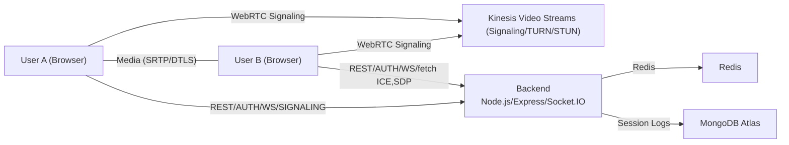
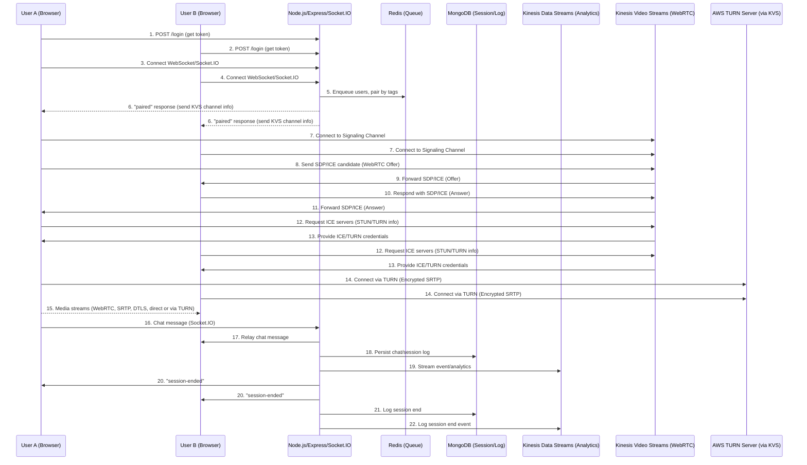

# Speed Connect – Cloud-Native 1:1 Video Networking

A robust, cloud-ready template for real-time 1:1 video and chat, using Node.js/React, AWS-managed WebRTC (Kinesis Video Streams), ECS, and CI/CD best practices.

---

## Features

- Instant, tag-based user matching
- Encrypted 1:1 video chat (WebRTC + AWS KVS signaling/TURN/STUN)
- Auto-disconnect after 5 minutes
- Real-time chat
- Stateless, scalable, analytics-ready

---

## Architecture

### Flowchart Diagram



### Sequence Diagram



---

## Run Locally (Docker Compose)

```sh
git clone &lt;repo-url&gt; speed-connect
cd speed-connect/other
cp .env.example .env   # Edit Mongo, Redis as needed
docker-compose up --build
```
- Frontend: http://localhost:5173
- Backend: http://localhost:4000

Usage:
- Open two browser tabs, login with different UIDs/tags
- Each sees their own camera; when paired, video and chat are enabled

---

## Cloud Deployment

### CloudFormation Stack

- Deploys KVS WebRTC signaling channel
- ECS Fargate backend (Dockerized)
- ElastiCache Redis
- IAM roles

**Edit your VPC/Subnets, Mongo Atlas URI, and ECR image in parameters.**

```sh
aws cloudformation deploy \
  --stack-name speedconnect-stack \
  --template-file cloudformation.yaml \
  --capabilities CAPABILITY_NAMED_IAM \
  --parameter-overrides \
    BackendImage=&lt;ecr-url&gt; \
    MongoUrl=&lt;mongo-uri&gt; \
    VpcId=&lt;vpc-id&gt; \
    Subnets="subnet-xxxx,subnet-yyyy"
```

---

### GitHub Actions CI/CD

- Auto builds/pushes backend Docker image to ECR
- Deploys/updates CloudFormation stack on `main` branch push

1. Configure secrets:
    - AWS credentials, ECR info, Mongo URI, VPC/Subnets
2. Push to `main` branch—GitHub Actions takes care of build and deployment

---

## How it Works

1. Users login, backend matches on tags/interests
2. Backend provides KVS signaling channel (AWS-managed)
3. WebRTC media streams peer-to-peer or via AWS TURN (SRTP/DTLS encrypted)
4. Chat events relayed via backend, all events/analytics logged

---

## References

- [AWS Kinesis Video Streams WebRTC](https://docs.aws.amazon.com/kinesisvideostreams-webrtc-dg/latest/devguide/what-is-kinesis-video-webrtc.html)
- [ECS Fargate](https://aws.amazon.com/fargate/)
- [MongoDB Atlas](https://www.mongodb.com/atlas)
- [GitHub Actions](https://docs.github.com/en/actions)
- [WebRTC Security](https://webrtc-security.github.io/)

---

*Start local, scale to global in minutes. Built for ops-free video networking.*
